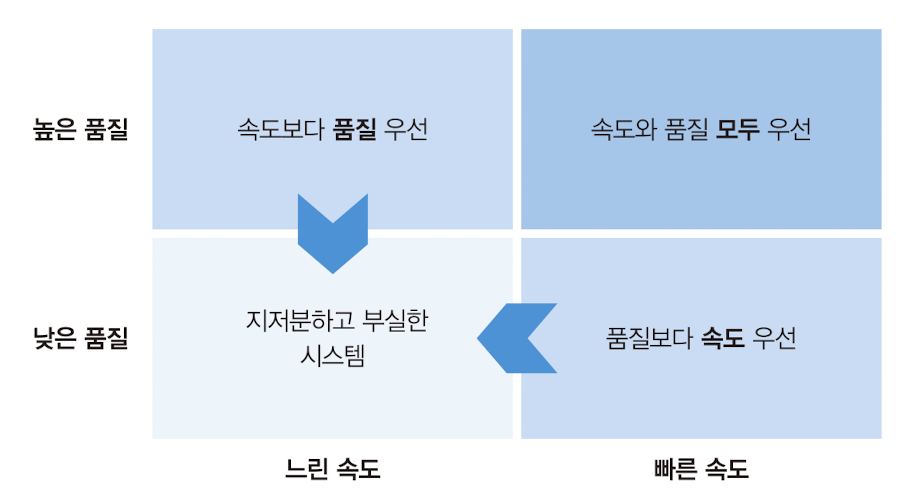

### Use Infrastructure as Code to Optimize for Change

_Given that changes are the biggest risk to a production system, continuous change is inevitable, and making changes is the only way to improve a system, it makes sense to optimize your capability to make changes both rapidly and reliably._

_변경이 생산 시스템에 가장 큰 위험을 가져다주며, 지속적인 변경은 불가피하고, 시스템을 개선하는 유일한 방법이 변경임을 감안할 때, 신속하고 신뢰성 있게 변경할 수 있는 능력을 최적화하는 것이 합리적임_

Research from the Accelerate State of DevOps Report supports this, showing that making changes frequently and reliably is correlated to organizational success.

Accelerate State of DevOps 보고서의 연구는 자주 그리고 신뢰성 있게 변경을 하는 것이 조직의 성공과 관련이 있음을 지지함

 

#### Common Objections to Implementing Automation for Change

1. **Objection: "We don’t make changes often enough to justify automating them"**

    _Many believe systems are "done" once built, making automation seem unnecessary. However, most actively used systems undergo continuous changes._

    _많은 사람들은 시스템이 구축되면 "완성"된다고 생각하여 자동화가 불필요한 것처럼 보임. 그러나 대부분 활발히 사용되는 시스템은 지속적인 변경을 겪음_

2. **Objection: "We should build first and automate later"**

    _Starting with Infrastructure as Code can seem daunting, and its value might not be immediately obvious. However, automating later often sacrifices benefits and makes it harder to implement._

    _코드형 인프라로 시작하는 것은 어려워 보일 수 있고, 그 가치가 바로 명확하지 않을 수 있음. 그러나 나중에 자동화하는 것은 종종 혜택을 희생시키고 구현하기 더 어렵게 만듦_

3. **Objection: "We must choose between speed and quality"**

    _It's a common misconception that speed compromises quality. However, research and Agile/Lean practices show that high performers excel in both._

    _속도가 품질을 저하시킨다는 것은 일반적인 오해임. 그러나 연구와 애자일/린 관행은 고성능 팀이 둘 모두에서 뛰어남을 보여줌_

 

#### Navigating the Quadrants of Speed and Quality

-   **Lower-right quadrant:** _Prioritizing speed over quality leads to fragile systems and slowed progress._

    -   **하단-오른쪽 사분면:** _속도를 품질보다 우선시하는 것은 취약한 시스템을 초래하고 진행을 늦춤_

-   **Upper-left quadrant:** _Prioritizing quality over speed results in slow, cumbersome processes that inhibit improvement._

    -   **상단-왼쪽 사분면:** _품질을 속도보다 우선시하는 것은 개선을 저해하는 느리고 번거로운 프로세스를 초래함_

-   **Upper-right quadrant:** _The goal is to excel in both speed and quality, achievable through modern approaches like Lean, Agile, and DevOps._

    -   **상단-오른쪽 사분면:** _속도와 품질 모두에서 뛰어나게 하는 것이 목표이며, Lean, Agile, DevOps와 같은 현대적 접근 방식을 통해 달성 가능함_

_A fundamental truth of the Cloud Age is: Stability comes from making changes. Unpatched systems are vulnerable and not stable. The ability to rapidly and reliably make changes is critical for maintaining stability._

_클라우드 시대의 근본적인 진실은: 안정성은 변경으로부터 온다는 것임. 패치되지 않은 시스템은 취약하고 안정적이지 않음. 신속하고 신뢰성 있게 변경할 수 있는 능력은 안정성을 유지하는 데 있어 핵심적임_

The solution to these objections is not to shy away from automation or delay its implementation. Instead, build your system incrementally, automating as you go, to ensure a steady stream of value delivery while also building the capability for continuous improvement.

이러한 반대 의견에 대한 해결책은 자동화를 피하거나 그 구현을 지연시키는 것이 아님. 대신, 점진적으로 시스템을 구축하면서 자동화를 진행하여, 지속적인 가치 전달의 안정적인 흐름을 보장하고 동시에 지속적인 개선 능력을 구축함

 

#### Key Takeaways:

-   **Optimizing for change is essential:** _Frequent and reliable changes lead to organizational success. Infrastructure as Code enables this by allowing for rapid and reliable changes to infrastructure._

    -   **변경을 위한 최적화는 필수적임:** _자주 발생하고 신뢰할 수 있는 변경은 조직의 성공으로 이어짐. 코드형 인프라는 인프라에 대한 신속하고 신뢰할 수 있는 변경을 가능하게 하여 이를 지원함_

-   **Automation is key:** _Despite objections, automating infrastructure provisioning and changes is crucial for achieving speed and quality simultaneously._

    -   **자동화가 핵심임:** _반대에도 불구하고, 인프라 제공 및 변경을 자동화하는 것은 속도와 품질을 동시에 달성하는 데 있어 중요함_

-   **Stability through change:** _Embracing continuous change is vital for system stability in the Cloud Age. This means prioritizing automation and adopting practices like Agile, Lean, and DevOps._

    -   **변경을 통한 안정성:** _클라우드 시대에 시스템 안정성을 위해 지속적인 변경을 수용하는 것이 중요함. 이는 자동화를 우선시하고 애자일, 린, DevOps와 같은 관행을 채택하는 것을 의미함_

Remember, the path to high performance and stability is not choosing between speed and quality but achieving excellence in both. Infrastructure as Code is a foundational element in this journey, enabling teams to build, change, and maintain their systems efficiently and effectively.

기억해야 할 것은, 고성능과 안정성으로 가는 길은 속도와 품질 사이에서 선택하는 것이 아니라, 둘 모두에서 우수성을 달성하는 것임. 코드형 인프라는 이 여정에서 기초적인 요소로, 팀이 효율적이고 효과적으로 시스템을 구축, 변경 및 유지 관리할 수 있게 함
