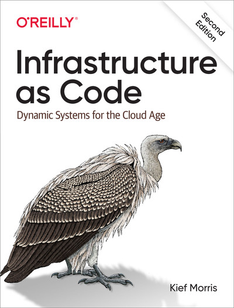

# Infrastructure as Code, 2nd Edition

### Table of Contents

CHAPTER 1 코드형 인프라란?

1.1 구시대에서 클라우드 시대로

1.2 코드형 인프라의 이점

1.3 코드형 인프라를 사용한 변경 최적화

     _반대 1: 자동화를 도입할 만큼 변경이 자주 발생하지 않는다

     _반대 2: 구축 이후에 자동화를 도입해야 한다

     _반대 3: 속도와 품질 중 하나를 선택해야 한다

1.4 네 가지 주요 지표

1.5 코드형 인프라를 위한 세 가지 핵심 실행 방법

     _핵심 실행 방법 1: 모든 것을 코드로 정의한다

     _핵심 실행 방법 2: 코드를 지속적으로 테스트하고 딜리버리한다

     _핵심 실행 방법 3: 시스템을 작고 간단하게 빌드한다

1.6 마치며

 

CHAPTER 2 클라우드 시대 인프라의 원칙

2.1 원칙 1: 시스템을 신뢰할 수 없다고 가정한다

2.2 원칙 2: 모든 것은 재생산 가능하다

2.3 위험: 스노우플레이크 시스템

2.4 원칙 3: 사라질 수 있는 것으로 만든다

2.5 원칙 4: 다양성을 최소화한다

2.6 원칙 5: 어떤 프로세스라도 반복 가능한지 확인한다

2.7 마치며

 

CHAPTER 3 인프라 플랫폼

3.1 인프라 시스템의 구성 요소

3.2 동적 인프라 플랫폼

3.3 인프라 리소스

3.4 마치며

 

CHAPTER 4 핵심 실행 방법 1: 모든 것을 코드로 정의한다

4.1 코드로 정의할 수 있는 것

4.2 인프라 언어

4.3 인프라를 코드로 정의하기 위한 구현 원칙

4.4 마치며

 

 

PART 2 인프라 스택으로 작업하기

CHAPTER 5 코드로 인프라 스택 구축하기

5.1 인프라 스택이란?

5.2 스택 구조화를 위한 패턴과 안티패턴

     _안티패턴: 모놀리식 스택

     _패턴: 애플리케이션 그룹 스택

     _패턴: 서비스 스택

     _패턴: 마이크로 스택

5.3 마치며

 

CHAPTER 6 스택으로 환경 구축하기

6.1 환경이란?

6.2 환경 구축을 위한 패턴

     _안티패턴: 멀티 환경 스택

     _안티패턴: 복사-붙여넣기 환경

     _패턴: 재사용 가능한 스택

6.3 멀티 스택으로 환경 구축하기

6.4 마치며

 

CHAPTER 7 스택 인스턴스 구성하기

7.1 스택 파라미터를 사용한 고유 식별자 생성

7.2 스택 파라미터 예제

7.3 스택 구성을 위한 패턴

     _안티패턴: 수동 스택 파라미터

     _패턴: 스택 환경 변수

     _패턴: 스크립트 파라미터

     _패턴: 스택 구성 파일

     _패턴: 래퍼 스택

     _패턴: 파이프라인 스택 파라미터

     _패턴: 스택 파라미터 레지스트리

7.4 파라미터를 사용한 비밀 정보 처리

7.5 마치며

 

CHAPTER 8 핵심 실행 방법 2: 코드를 지속적으로 테스트하고 딜리버리한다

8.1 코드를 지속적으로 테스트해야 하는 이유

8.2 인프라 코드 테스트 관련 문제

     _문제 1: 선언형 코드는 테스트 가치가 낮다

     _문제 2: 인프라 코드 테스트는 느리다

     _문제 3: 의존성을 테스트를 복잡하게 만든다

8.3 프로그레시브 테스트

8.4 인프라 딜리버리 파이프라인

8.5 프로덕션 테스트

8.6 마치며

 

CHAPTER 9 인프라 스택 테스트하기

9.1 예제 인프라

9.2 예제 스택

9.3 스택에 대한 오프라인 테스트

9.4 스택에 대한 온라인 테스트

9.5 테스트 픽스터를 사용한 의존성 처리

9.6 스택의 테스트 인스턴스에 대한 생명 주기 패턴

     _패턴: 영구 테스트 스택

     _패턴: 임시 테스트 스택

     _안티패턴: 이중 스택 단계

     _패턴: 주기적인 스택 리빌드

     _패턴: 지속적인 스택 재설정

9.7 테스트 오케스트레이션

9.8 마치며

 

 

PART 3 서버와 여러 애플리케이션 런타임 플랫폼으로 작업하기

CHAPTER 10 애플리케이션 런타임

10.1 클라우드 네이티브와 애플리케이션 기반 인프라

10.2 애플리케이션 런타임 타깃

10.3 서버에 애플리케이션 배포하기

10.4 애플리케이션 클러스터에 애플리케이션 배포하기

10.5 클러스터로 애플리케이션을 배포하기 위한 패키지

10.6 FaaS 서버리스 애플리케이션 배포

10.7 애플리케이션 데이터

10.8 애플리케이션 네트워크 연결

10.9 서비스 검색

10.10 마치며

 

CHAPTER 11 코드형 서버 구축

11.1 서버 내부에는 무엇이 있을까?

11.2 서버 내용의 출처

11.3 서버 구성 코드

11.4 서버 코드 테스트

11.5 신규 서버 인스턴스 생성

11.6 서버 사전 빌드

11.7 신규 서버 인스턴스 구성

11.8 마치며

 

CHAPTER 12 서버 변경 관리

12.1 변경 적용 시기에 따른 변경 관리 패턴

     _안티패턴: 변경 중 적용

     _패턴: 지속적인 구성 동기화

     _패턴: 불변 서버

12.2 서버 구성 코드를 적용하는 방법

     _패턴: Push 서버 구성

     _패턴: Pull 서버 구성

12.3 여러 서버 생명 주기 이벤트

12.4 마치며

 

CHAPTER 13 코드형 서버 이미지

13.1 서버 이미지 빌드

13.2 서버 이미지의 원본

13.3 서버 이미지 변경

13.4 파이프라인을 사용한 서버 이미지 테스트와 딜리버리

13.5 멀티 서버 이미지

13.6 마치며

 

CHAPTER 14 코드형 클러스터 구축

14.1 애플리케이션 클러스터 구축

14.2 애플리케이션 클러스터를 위한 스택 토폴로지

14.3 애플리케이션 클러스터를 위한 공유 전략

14.4 FaaS 서버리스용 인프라

14.5 마치며

 

 

PART 4 인프라 설계

CHAPTER 15 핵심 실행 방법 2: 시스템을 작고 간단하게 빌드한다

15.1 모듈화를 위한 설계

15.2 인프라 모듈화

15.3 컴포넌트 간 경계

15.4 마치며

 

CHAPTER 16 컴포넌트에서 스택 빌드하기

16.1 스택 컴포넌트를 위한 인프라 언어

16.2 스택 컴포넌트 패턴

     _패턴: 퍼사드 모듈

     _안티패턴: 난독화 모듈

     _안티패턴: 비공유 모듈

     _패턴: 번들 모듈

     _안티패턴: 스파게티 모듈

     _패턴: 인프라 도메인 엔티티

16.3 추상화 계층 빌드

16.4 마치며

 

CHAPTER 17 스택을 컴포넌트로 사용하기

17.1 스택 간 의존성 검색

     _패턴: 리소스 매칭

     _패턴: 스택 데이터 조회

     _패턴: 통합 레지스트리 조회

17.2 마치며

 

 

PART 5 인프라 딜리버리

CHAPTER 18 인프라 코드 구조화하기

18.1 프로젝트와 저장소 구성

18.2 다양한 유형의 코드 구성

18.3 인프라와 애플리케이션 코드 관리

18.4 마치며

 

CHAPTER 19 인프라 코드 딜리버리하기

19.1 인프라 코드 딜리버리

19.2 프로젝트 통합

     _패턴: 빌드 타임 프로젝트 통합

     _패턴: 딜리버리 타임 프로젝트 통합

     _패턴: 어플라이 타임 프로젝트 통합

19.3 스크립트를 사용한 인프라 도구 래핑

19.4 마치며

CHAPTER 20 팀 워크플로

20.1 사람들

20.2 누가 인프라 코드를 작성할까?

20.3 인프라에 코드를 적용하는 방법

20.4 구성 드리프트를 방지하는 방법

20.5 파이프라인 기반 워크플로 거버넌스

20.6 거버넌스가 포함된 프로세스 예제

20.7 마치며

 

CHAPTER 21 안전한 인프라 변경

21.1 변경 범위 축소하기

21.2 불완전한 변경을 프로덕션에 푸시하기

21.3 실시간 인프라 변경

21.4 연속성

21.5 변화하는 시스템에서의 데이터 연속성

21.6 마치며